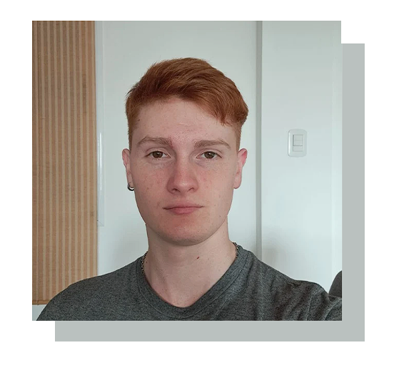

# TP0-CV

Modificar el archivo README.MD haciendo una breve descripcion de ustedes en vistas a aplicar a un nuevo trabajo de programacion (de manera ficticia claro esta), subir una foto y utilizar varios estilos (titulos, italicas, negrita, etc..) con el standar de Mark Down (MD)
Hacer una seccion de videojuegos favoritos.

# Maximiliano Andres Bianchimano

**Descripción**: Soy un estudiante de la universidad UNSAM, tengo conocimientos en C, Python, Assembly, Arduino, entre otros, me gusta programar, cocinar, hacer mountainbike e ir al gimnasio.

## Videojuegos Favoritos(no estan en orden)

1- **Batman: Arkham Knight** (toda la saga)
2- **(Dark Souls III)** (Todos los soulslike)
3- **Persona 5**
4- **The Witcher 3**
5- **Gears of War 4**

_Mi Gmail estudiantil es: [mgandresbianchimano@estudiantes.unsam.edu.ar](mailto:mgandresbianchimano@estudiantes.unsam.edu.ar)_
